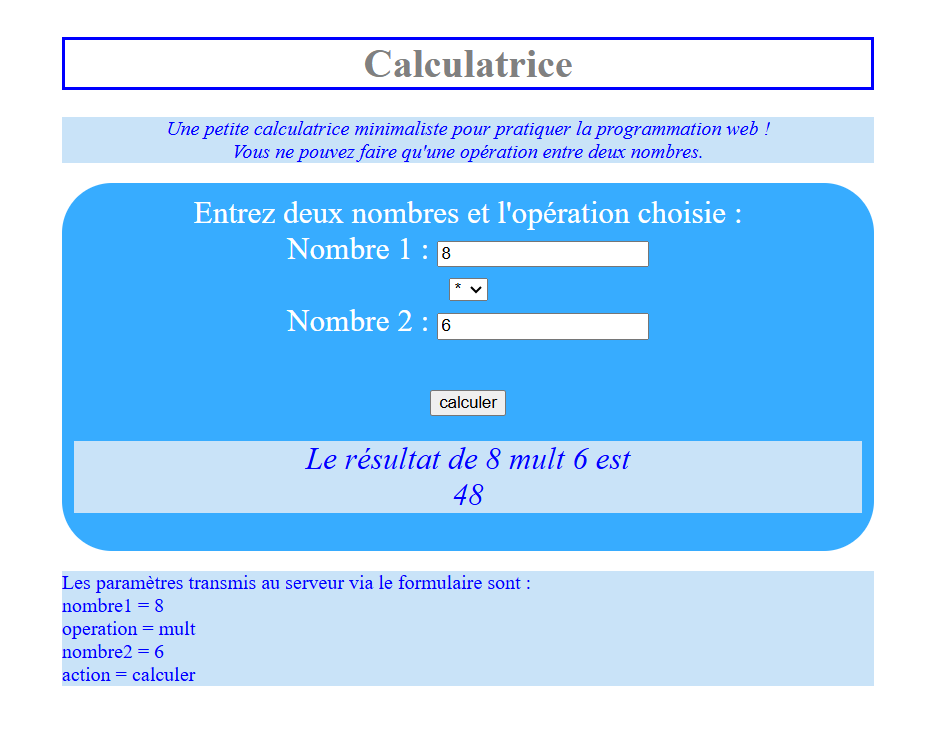

# Une calculatrice simple en PHP [projet universitaire]  

TP n°1 de l'UE [LIFRW : Introduction aux Réseaux et au Web](http://perso.univ-lyon1.fr/olivier.gluck/supports_enseig.html#LIFRW) réalisé lors de ma première année de prépa intégrée à [Polytech Lyon](https://polytech.univ-lyon1.fr/)

## Objectif

Réaliser une calculatrice toute simple en PHP, avec les opérations de base (addition, soustraction, multiplication, division) et une interface graphique en HTML/CSS. Le but était de se familiariser avec le langage PHP et le passage de données d'un formulaire HTML.

## Résultat    

Une copie du projet est hébergée [ici](https://projects.milobrt.fr/calculatrice)